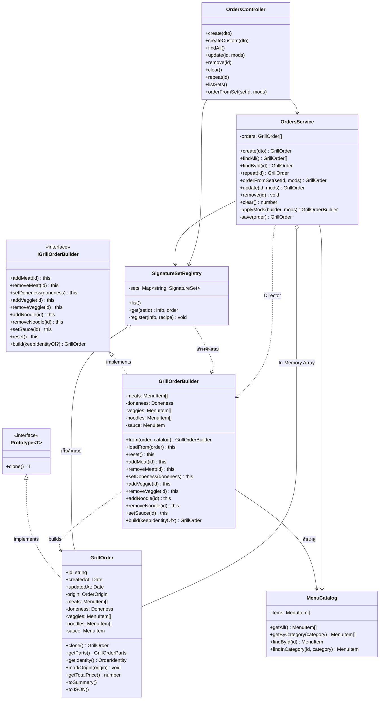

# 🔥 GrillByWayu — หมูกระทะตามใจคุณ

โปรเจกต์รายวิชา **Software Design and Pattern**
ระบบสั่ง **หมูกระทะ** ที่ลูกค้าเลือกเนื้อ ผัก เส้น และน้ำจิ้มได้เอง ใช้ **Builder Pattern** และ **Prototype Pattern**

---

## วัตถุประสงค์

- ฝึกนำ Design Pattern มาแก้ปัญหาจริงในระบบสั่งอาหาร
- ให้ลูกค้าจัดชุดหมูกระทะเองได้ทีละขั้น โดยระบบตรวจกฎของร้านทุกครั้ง
- ให้ลูกค้าสั่งซ้ำ และสั่งเซ็ตเมนูแนะนำพร้อมปรับเปลี่ยนได้ โดยเซ็ตต้นแบบไม่เสียหาย
- เก็บเมนูและราคาไว้ที่ backend ที่เดียว หน้าเว็บส่งมาแค่ `id` ของเมนู จึงแก้ราคาเองไม่ได้

---

## ปัญหาที่สนใจ

ตัวอย่างโค้ดแบบ "ก่อนใช้ Pattern" อยู่ที่ [without-pattern.example.ts](backend/src/orders/examples/without-pattern.example.ts) (ไว้โชว์ในวิดีโอ ระบบจริงไม่ได้ใช้)

1. **Telescoping Constructor**: ออเดอร์มีตัวเลือกเยอะ (เนื้อหลายอย่าง ความสุก ผัก เส้น น้ำจิ้ม) ถ้าใช้ constructor เดียว
   - ต้องใส่ `null` เต็มไปหมด อ่านไม่ออกว่าช่องไหนคืออะไร
   - สลับลำดับผิด (เอาน้ำจิ้มไปใส่ช่องความสุก) TypeScript ก็ไม่เตือน
   - ไม่มีที่ตรวจกฎของร้าน สร้างหมูสุกน้อยได้ทันที
2. **สั่งซ้ำต้องสร้างใหม่ทั้งหมด**: ต้องใส่ค่าซ้ำทุกตัว ถ้าวันหลังเพิ่ม field ใหม่ ต้องตามแก้ทุกจุด
3. **Shallow Copy ทำให้ของเดิมพัง**: `{ ...standardSet }` copy แค่ชั้นนอก ลูกค้าคนหนึ่งเพิ่มผัก แล้วเซ็ตต้นแบบก็ได้ผักนั้นไปด้วย

---

## Pattern ที่ใช้และเหตุผล

### Builder Pattern: จัดชุดเอง

**เหตุผล:** ใส่เฉพาะที่เลือก อ่านง่ายด้วย method chaining และ `build()` ตรวจกฎของร้านก่อนสร้างเสมอ

| บทบาท | คลาส | ไฟล์ |
|---|---|---|
| Product | `GrillOrder` | [grill-order.ts](backend/src/orders/grill-order.ts) |
| Builder interface | `IGrillOrderBuilder` | [grill-order.builder.interface.ts](backend/src/orders/grill-order.builder.interface.ts) |
| Concrete Builder | `GrillOrderBuilder` (implements `IGrillOrderBuilder`) | [grill-order.builder.ts](backend/src/orders/grill-order.builder.ts) |
| Director | `OrdersService.create()` | [orders.service.ts](backend/src/orders/orders.service.ts) |

`build(keepIdentityOf?)` ตรวจกฎของร้าน แล้ว reset ตัวเองรอออเดอร์ถัดไป
1. ต้องมีเนื้ออย่างน้อย 1 อย่าง
2. ต้องเลือกระดับความสุก
3. **หมูและไก่ต้อง "สุกมาก" เท่านั้น** (เนื้อวัวสุกน้อยได้)
4. ต้องเลือกน้ำจิ้ม 1 อย่าง

นอกจากนี้ Builder ยังตรวจว่าเมนูอยู่ถูกหมวด เช่น ใส่ข้าวโพดในช่องเนื้อไม่ได้

ถ้าส่ง `keepIdentityOf` (ใช้ตอนแก้ไขออเดอร์) ออเดอร์ที่ได้จะใช้ `id`, `createdAt`, `origin` ของตัวเดิม และมี `updatedAt` ถ้าไม่ส่งจะได้ออเดอร์ใหม่ id ใหม่

```ts
new GrillOrderBuilder(catalog)
  .addMeat('pork-belly').setDoneness('สุกมาก')
  .addVeggie('morning-glory').setSauce('suki-sauce')
  .build();
```

### Prototype Pattern: สั่งซ้ำ และเซ็ตเมนูแนะนำ

**เหตุผล:** สั่งซ้ำได้ในบรรทัดเดียวด้วย `clone()` และเป็น **Deep Copy** แก้ตัวใหม่แล้วเซ็ตต้นแบบไม่เปลี่ยนตาม

| บทบาท | คลาส | ไฟล์ |
|---|---|---|
| Prototype interface | `Prototype<T>` (มี `clone()`) | [prototype.interface.ts](backend/src/common/prototype.interface.ts) |
| Concrete Prototype | `GrillOrder.clone()` | [grill-order.ts](backend/src/orders/grill-order.ts) |
| Prototype Registry | `SignatureSetRegistry` | [signature-set.registry.ts](backend/src/orders/signature-set.registry.ts) |

- `clone()` สร้าง array และ object ข้างในใหม่ทั้งหมด ตัวที่คัดลอกได้ `id` และ `createdAt` ใหม่
- **สั่งซ้ำ:** `OrdersService.repeat()` clone ออเดอร์เดิม แล้วติดป้าย "สั่งซ้ำจาก #..."
- **เซ็ตแนะนำ:** Registry สร้างต้นแบบด้วย Builder ครั้งเดียวตอนเปิดระบบ และ `get()` คืนสำเนาทุกครั้ง

### ใช้ร่วมกัน: Prototype + Builder

**เหตุผล:** `GrillOrder` เก็บข้อมูลเป็น `private readonly` แก้ตรงๆ ไม่ได้ การปรับเซ็ตหรือแก้ไขออเดอร์จึง clone ของเดิมแล้วประกอบใหม่ด้วย Builder ซึ่งต้องผ่านกฎของร้านใน `build()` เหมือนเดิมเสมอ

| เมธอด | ขั้นตอน | ผลลัพธ์ |
|---|---|---|
| `OrdersService.orderFromSet()` | clone เซ็ตต้นแบบ → `GrillOrderBuilder.from()` → ปรับ → `build()` | ออเดอร์ใหม่ id ใหม่ |
| `OrdersService.update()` (แก้ไขออเดอร์) | clone ออเดอร์เดิม → `GrillOrderBuilder.from()` → ปรับ → `build(original)` | id และ `createdAt` เดิม มี `updatedAt` แทนที่ตัวเดิมในตำแหน่งเดิม |

- ทั้งสองเมธอดใช้ `ModifyOrderDto` และ `applyMods()` ตัวเดียวกัน
- ถ้าแก้ไขแล้วผิดกฎ ได้ `400` และออเดอร์เดิมไม่เปลี่ยน
- ออเดอร์ที่สั่งซ้ำจากตัวที่ถูกแก้ไม่เปลี่ยนตาม เพราะ `clone()` เป็นคนละ object

---

## Class Diagram



---

## API

Backend รันที่ `http://localhost:3001`

| Method | Path | Pattern | ต้อง login | หน้าที่ |
|---|---|---|---|---|
| POST | `/auth/login` | – | ไม่ต้อง | เข้าสู่ระบบ body `{ username, password }` ได้ `200` พร้อม `{ token, username }` |
| POST | `/auth/logout` | – | 🔒 ต้อง | ออกจากระบบ ได้ `204` token เดิมใช้ไม่ได้อีก |
| GET | `/auth/me` | – | 🔒 ต้อง | ดูผู้ใช้ที่เข้าสู่ระบบอยู่ คืน `{ username }` |
| GET | `/menu` | – | ไม่ต้อง | เมนูทั้งหมดแยกหมวด และระดับความสุก |
| POST | `/orders` | Builder | 🔒 ต้อง | จัดชุดเอง |
| POST | `/orders/custom` | Builder | 🔒 ต้อง | เส้นทางเดิม ทำงานเหมือน `POST /orders` |
| GET | `/orders` | – | 🔒 ต้อง | ประวัติออเดอร์ (ใหม่สุดก่อน) |
| POST | `/orders/:id/clone` | Prototype | 🔒 ต้อง | สั่งซ้ำ |
| PATCH | `/orders/:id` | Prototype + Builder | 🔒 ต้อง | แก้ไขออเดอร์ (body แบบเดียวกับการปรับเซ็ต) ได้ id เดิม และมี `updatedAt` |
| DELETE | `/orders/:id` | – | 🔒 ต้อง | ลบออเดอร์ 1 รายการ ได้ `204` ไม่มี body |
| DELETE | `/orders` | – | 🔒 ต้อง | ล้างประวัติทั้งหมด คืน `{ "deleted": จำนวนที่ลบ }` |
| GET | `/sets` | Prototype | ไม่ต้อง | เซ็ตเมนูแนะนำ |
| POST | `/sets/:setId/order` | Prototype + Builder | 🔒 ต้อง | สั่งเซ็ต ปรับได้ (ส่ง body ว่างคือสั่งตามเดิม) |

endpoint ที่ต้อง login ให้แนบ header `Authorization: Bearer <token>` ถ้าไม่มีหรือ token ใช้ไม่ได้ ได้ `401` "กรุณาเข้าสู่ระบบก่อน"

การลบมีผลกับประวัติออเดอร์เท่านั้น เซ็ตต้นแบบไม่ถูกลบ และลบออเดอร์ต้นฉบับแล้ว ออเดอร์ที่สั่งซ้ำจากมันยังอยู่ เพราะ `clone()` เป็นคนละ object

ตัวอย่าง `POST /orders`

```json
{ "meatIds": ["beef-slice"], "doneness": "สุกกลาง", "veggieIds": ["corn"], "sauceId": "jaew-sauce" }
```

ได้ `201` พร้อมออเดอร์ `totalPrice: 149` และ `origin: { "type": "custom" }`

ตัวอย่าง `POST /sets/standard/order` (เปลี่ยนน้ำจิ้ม)

```json
{ "sauceId": "jaew-sauce" }
```

ฟิลด์ที่ปรับได้ (ใช้กับ `POST /sets/:setId/order` และ `PATCH /orders/:id`): `addMeatIds`, `removeMeatIds`, `addVeggieIds`, `removeVeggieIds`, `addNoodleIds`, `removeNoodleIds`, `sauceId`, `doneness`

- ผิดกฎของร้านหรือข้อมูลผิดรูปแบบได้ `400`
- หา id ไม่เจอได้ `404`
- ฟิลด์ที่ไม่รู้จักถูกตัดทิ้ง เช่น ส่ง `price` มาเองก็ไม่มีผล

---

## วิธีติดตั้งและรัน

ต้องมี Node.js และ npm

| ส่วน | เทคโนโลยี | พอร์ต |
|---|---|---|
| Backend | NestJS 12 + TypeScript + class-validator | 3001 |
| Frontend | Next.js 16 + React 19 + Tailwind CSS 4 | 3000 |

**1. Backend**

```bash
cd backend
npm install
npm run start:dev     # http://localhost:3001
```

**2. Frontend** (เปิดอีกหน้าต่าง terminal)

```bash
cd frontend
npm install
cp .env.example .env.local   # NEXT_PUBLIC_API_URL=http://localhost:3001
npm run dev                  # http://localhost:3000
```

ข้อมูลออเดอร์เก็บใน In-Memory Array ปิด backend แล้วข้อมูลหาย

---

## การเข้าสู่ระบบ

ระบบเข้าสู่ระบบแบบง่ายสำหรับเดโม มีบัญชีเดียว

| ชื่อผู้ใช้ | รหัสผ่าน |
|---|---|
| `wayu` | `1234` |

- เปลี่ยนบัญชีได้ด้วย environment variable ของ backend `AUTH_USERNAME` และ `AUTH_PASSWORD` ถ้าไม่ตั้งไว้จะใช้บัญชีด้านบน
- ชื่อผู้ใช้และรหัสผ่านอยู่ที่ backend เท่านั้น ไม่มีในโค้ด frontend
- เปิด http://localhost:3000 แล้วยังไม่ได้เข้าสู่ระบบ จะถูกพาไปหน้า `/login`
- ฝั่ง API: `GET /menu` และ `GET /sets` เรียกได้โดยไม่ต้อง login ส่วนการสั่ง ดูประวัติ สั่งซ้ำ แก้ไข และลบ ต้อง login ก่อน (ดูคอลัมน์ "ต้อง login" ในตาราง API) ฝั่งหน้าเว็บต้อง login ก่อนเข้าหน้าหลัก
- หน้าเว็บเก็บ token ใน `sessionStorage` ปิดแท็บแล้วต้องเข้าสู่ระบบใหม่
- token เก็บใน In-Memory Map ของ backend ถ้า restart backend ทุก token จะใช้ไม่ได้ หน้าเว็บจะพาไปหน้า login พร้อมข้อความ "หมดเวลาเข้าสู่ระบบ กรุณาเข้าสู่ระบบใหม่"
- ทดสอบผ่าน Swagger UI (http://localhost:3001/docs): เรียก `POST /auth/login` แล้วนำ `token` ไปใส่ที่ปุ่ม **Authorize**

---

## วิธีรันเทสต์

```bash
cd backend
npm run test       # unit test ของ Builder และ Prototype
npm run test:e2e   # e2e test ของ API ทั้งหมด (ใช้ test/jest-e2e.json)
npm run lint
```

```bash
cd frontend
npx tsc --noEmit
npm run lint
```

| ไฟล์ | ทดสอบอะไร |
|---|---|
| [grill-order.builder.spec.ts](backend/src/orders/grill-order.builder.spec.ts) | คิดราคาถูก, ไม่มีเนื้อ, หมูสุกน้อย, เนื้อวัวสุกน้อยได้, ไม่มีน้ำจิ้ม, ใส่ผิดหมวด, reset หลัง build |
| [grill-order.prototype.spec.ts](backend/src/orders/grill-order.prototype.spec.ts) | clone ได้ id ใหม่, deep copy ต้นฉบับไม่เปลี่ยน, `getParts()` ไม่รั่ว, Registry คืนคนละ object |
| [orders.e2e-spec.ts](backend/test/orders.e2e-spec.ts) | `GET /menu`, `POST /orders`, หมูสุกน้อยได้ 400, สั่งซ้ำ, 404, ปรับเซ็ตแล้วต้นแบบไม่เปลี่ยน, ลำดับประวัติ |

> ⚠️ **หมายเหตุ Jest กับ NestJS 12:** NestJS 12 เป็น ES Module และใช้ `import.meta` Jest จึงโหลดได้เมื่อใช้ **Node.js 24.9 ขึ้นไป** และรันด้วย `--experimental-vm-modules` เท่านั้น
>
> ```bash
> node --experimental-vm-modules node_modules/jest/bin/jest.js
> node --experimental-vm-modules node_modules/jest/bin/jest.js --config ./test/jest-e2e.json
> ```
